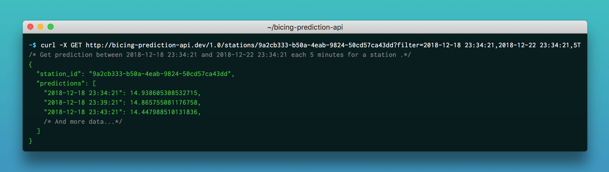
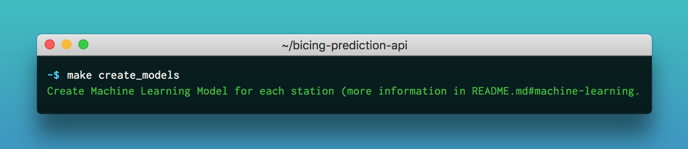
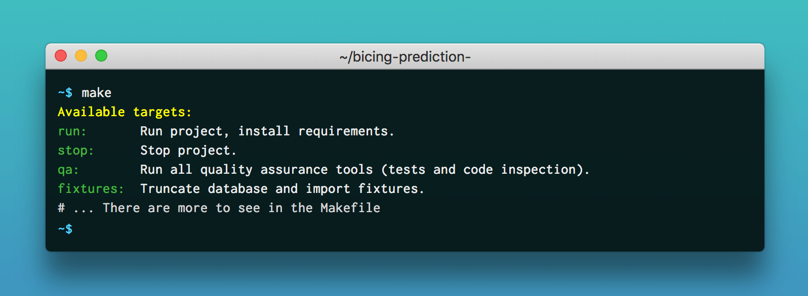
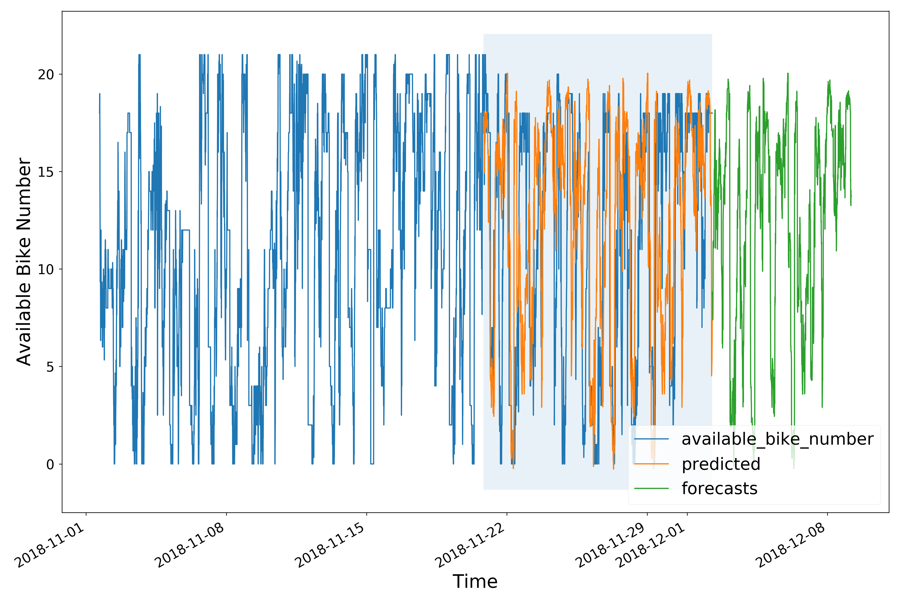
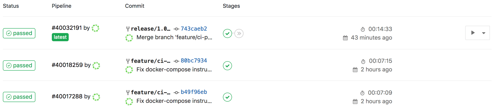

<p align="center">
    
</p>
<h1 align="center">Bicing Prediction API</h1>

<h4 align="center">Predict bikes' availability for Barcelona public bicycle sharing system.</h4>

> The goal of this REST API is to predict the number of bikes or slots available for a [Bicing][bicing] station at a specific time.  
> By analysing data from different providers and building prediction model foreach [Bicing][bicing]'s station, it can advice customers of the best time to pick or return a bike at a station.

<p align="center">
    
    
    
    <a href="https://opensource.org/licenses/MIT"><a>
</p>

<p align="center">
  <a href="#getting-started">Getting Started</a> •
  <a href="#features">Features</a> •
  <a href="#built-with">Built With</a> •
  <a href="#development">Development</a> •
  <a href="#machine-learning">Machine Learning</a> •
  <a href="#ci-and-deployment">CI and Deployment</a>
</p>





## <a name="getting-started"></a> Getting Started
### Prerequisites

To install and run the API you need [Docker Compose](docker-compose) and... that's all.
Please follow the [official documentation](docker-compose-install) to install it on your environment.

### Installing
Clone the project and run the default installation:

```bash
git clone https://github.com/lechatquidanse/bicing-prediction-api.git && cd bicing-prediction-api && make install
```
Your docker containers should have been successfully built and run.

## Features

Multiple features are proposed across 2 user interfaces, a REST API and command-line commands:

### REST API:


### CLI:



## <a name="built-with"></a> Built with

- [Docker][docker]
- [Flask][flask]
- [Python 3.7][python]
- [XGBoost][xgboost]

## Development
The Makefile contains useful command for development purpose



### Domain Driven Design

Code and folder structure follow Domain Driven Design (DDD).  
Here is a good article to understand naming and folder [Domain Driver Design, little explanation and example](https://jorgearco.com/ddd-with-symfony/), even if the technology used is PHP.

    src
        \
            |\ Application     `Contains the Use Cases and the Processes of the domain system, commands, handlers and data providers`
            |
            |\ Domain          `The system business logic layer (Models, Exceptions...)`
            |
            |\ Infrastructure  `Its the implementation of the system outside the model. I.E: Persistence, Query, etc`
            |
            |\ UserInterface   `It contains all the interfaces allowed for a user of the API (Cli, Rest, etc)`

## <a name="machine-learning"></a> Machine Learning

For a each stations a prediction model is created thanks to machine learning algorithms.
It will allow us to forecast the number of bikes/slots available at a specific time.

Here is some very helpful resources that I encourage you to read to understand machine learning and forecasting algorithm:
- [Machine Learning basics tutorial](https://www.youtube.com/watch?v=G7fPB4OHkys)
- [France Prediction for bike availability at bike sharing stations](https://oslandia.com/en/2018/01/30/predict-bike-availability-at-bike-sharing-stations/)
- [Forecasting Valencia’s bike share system](https://towardsdatascience.com/understanding-arima-models-using-valenbisi-valencias-bike-share-system-dcbe13b3e8a)
- [Understand Time Series Prediction](https://machinelearningmastery.com/time-series-forecasting/)
- [Time-Series-ARIMA-XGBOOST-RNN Implementation](https://github.com/Jenniferz28/Time-Series-ARIMA-XGBOOST-RNN)

### Time Series Forecasting

To create a prediction model, our machine needs data.
For now, data used come from [Bicing Statistics Api project](https://github.com/lechatquidanse/bicing-api)

Those data are a sequence of observations (availabilites for each stations) taken sequentially in time.
So in order to provide prediction, we choose to use time series technique.

> This technique predict future events by analyzing the trends of the past, on the assumption that future trends will hold similar to historical trends

The implementation of this algorithm is made with A Regression tree-based XGBoost.

### Results

Here is the result for `33 - C/PONTEVEDRA / JUDICI` station:
-  `In blue, the data provided to train the prediction model`
-  `In orange, the data provided to validate the prediction model`
-  `In green, the data forecasted by the prediction model`
 



### Improvement

The algorithm implementation is a first version.
So it's very naive and could be improved by a lot of different approach.
Adding weather, station's geo-location or holiday calendar dataset to train the model could make predictions more accurate.    

## <a name="ci-and-deployment"></a> CI and Deployment

CI and deployment can be handled through [Gitlab][gitlab] and [Docker][docker] thanks to [.gitlab-ci.yml](./.gitlab-ci.yml)
It contains 3 different stages.

### Test

Environment 'test' is triggered when a 'feature/*' branch is pushed to the repository. 
It will then install project and launch qa tools. 

### Build

Environment 'build' is triggered when a 'release/*' branch is pushed to the repository. 
It will then install project, launch qa tools and then build and push a docker image on a registry if no error occured.

### Production

This manual action, will pull the image build by the previous step and update the specific container.




## License

[MIT](https://opensource.org/licenses/MIT)

> Stéphane EL MANOUNI &nbsp;&middot;&nbsp;
> [Linkedin](https://www.linkedin.com/in/stephane-el-manouni/)


[bicing]: https://www.bicing.cat/
[docker]: https://www.docker.com/
[docker-compose]: https://docs.docker.com/compose/
[docker-compose-install]: https://docs.docker.com/compose/install
[gitlab]: https://gitlab.com/
[flask]: http://flask.pocoo.org/
[python]: https://www.python.org/downloads/release/python-370/
[xgboost]: https://xgboost.readthedocs.io/en/latest/
